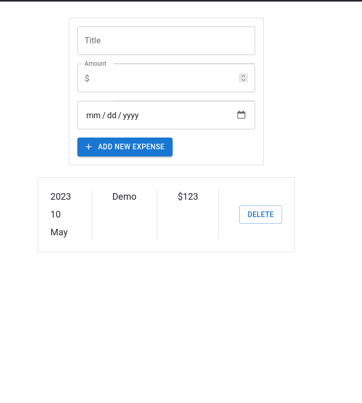

# Expense-Tracker

- A basic expense tracker in react that stores data in localStorage. A basic project built while learning React.

## Run

- Git Clone the project
- `cd expense-tracker`
- `pnpm install`
- `pnpm run dev`

## UI

